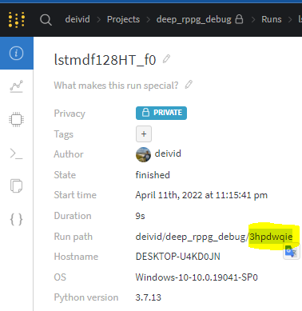

# deep-rppg
Repository with the experiments made in my PHD
# Weights and biases
This code uses Weights and biases tool. When using personal computer be sure of have installed plotly libraries.

# About main.py
The first inputs are related with weights and biases options
WNB = Weights and biases 
|    input        | Description  | choices | default |Required|
| :--- |:---|:---|:---|:---|
| use_wandb(int) | Flag to use WNB. If this value is 0, then there is no need to specify: is_SWEEP, project_name, run_name, is_resume,run_id | 0:No. 1:Yes| 1 | No|
| is_SWEEP(int) | Flag to use hyperparameter tuning | 0:No. 1:Yes. | 0|No|
| project_name(str) | Name of the WNB project | None | None |No, unless use_wandb is 1|
| run_name(str) | Name of the current experiment (run) in WNB| None | None |No, unless use_wandb is 1|
| is_resume(int) | Flag to resume a training process. Must give "run_id"| 0:No. 1:Yes. | 0 | No|Yes|
| run_id(str) | Used only when is_resume is True (1). Copy and paste the run_id given by the WNB run [^run_id]| None | Random id |  No, unless use_wandb and is_resume are 1|
[^run_id]: 

|    input        | Description  | choices | default |Required|
| :--- |:---|:---|:---|:---|
| in_COLAB(int) | Flag to specify if we are working in Google Colaboratoy | 0:Personal computer. 1:Google Colab.| 0 | No|
| is_reproducible(int) | Flag to specify that we want to replicate our results. It uses seed option (It is slower than without reproducibility) | 0:No. 1:Yes.| 1 | No|
| seed(int) | Seed use if is_reproducible is True | None| 10 | No|
| load_dataset_path(str) | Path where the database is located | None| None | Yes|
| save_path(str) | Path where the output files will be located | None| None | Yes|
| database_name(str) | Name of the database to be used | "**MMSE**":MMSE-HR. "**VIPL**":VIPL-HR. "**ECGF**":ECG-Fitness. "**VIPL_ECGF**":Trained in VIPL-HR to test in ECGFitness| None | Yes|
| dataset_percentage(float) | Percentage of the database to be used | Values between 0 and 1 where 1 is 100%. (Using negative values means you are going to take only that quantity of subjects, e.x. -5 will take the first 5 subjects. **Debugging only**)| 1 | No|
| fold(int) | By default we use 5-fold cross validation. Specify which fold. At the end of your experiment you should have run this script 5 times changing this option between [0,1,2,3, and 4] | "**0**":Fold0. **1**":Fold1. "**2**":Fold2. "**3**":Fold3. "**4**":Fold4. "**-1**":Train_test_split(80%train/20%test). "**-2**":Train in all data. Useful when preparing to use cross-dataset| None | Yes|
| channels(str) | Database input color channel | "**RGB**". "**YUV**". "**HSV**". "**Lab**". "**Luv**". "**YCrCb**"| "YUV" | No|
| img_size(int) | Define the width_height input size of the images database| **2**:2x2. **4**:4x4. **8**:8x8. **16**:16x16. **32**:32x32. **64**:64x64. **128**:128x128 | 64 | No|
| save_model_each_n_epochs(int) | Specify how many epochs the model with their weights should be saved. | None | 1 | No|
| is_5050_validation(int) | Flag to train on half of the database and test on the other half (fold must be 0 or 1) | 0:No. 1:Yes | 0 | No|
| use_data_augmentation(int) | Flag to use data augmentation during training| 0:No. 1:Yes | 0 | No|
| hard_attention(int) | Flag to use hard attention| 0:No. 1:Yes | 0 | No|
| optimizer(str) | Optimizer to be used during training | "ADAM". "ADADELTA"  | None | Yes|
| loss(str) | loss function to be used during training | 
"**NP**"Negative Pearson's correlation. "**NP_NSNR**"Negative Pearson's correlation+SNR. "**MSE**":Mean Squared Error. "**MAEINHR**". "**MSEINHR*". "**PSNR**". "**MSEN1FFT**". "**MSEN2FFT**". "**NSNR**". "**HRMAE**"."**NP_MSEN1FFT**". | None | Yes|
| metric(str) | Metric to be used during validation. This metric will be in charge of saving the best weights during training | "**hrhatmae**". "**hrmae**":mean absulte error in Heart rate . "**hrr**":Pearson's correlation in Heart rate. "**snr**":Signal to noise ratio.| hrmae | Yes|
| network(str) | Network or model to be used | "PHYSNET","RPPGNET","UB8","LSTMDF125","LSTMDF128","P64","PS1","PS2","PS3","PS4","PB1","PB2","UBS1","UB64","UB32","UB16","UB8","UB8_RGBYUV","UB4","UB2","UB64HR","UBS2","UBS3" | None | Yes|
| epochs(int) | Number of epochs for trainig | None | 15 | No|
| batch_size(int) | Batch size to be used | None | 8 | Yes|
| learning_rate(float) | Learning rate to be used | None | 0.0001 | Yes|
| lambda_loss(float) | lambda compensation value in combined loss functions like NP_NSNR. | None | 1 | No|
| window(int) | Size of the slidding window during training and testing. | Values between [0,128] | 128 | No|
| step_tr(int) | Step of the slidding window during training. | Values between [0,128] | 128 | No|
| step_eval(int) | Step of the slidding window during testing. | Values between [0,128] | 128 | No|
| is_prediction(int) | Flag to do the inference procedure and predict all subjects in testing set of the current fold. | 0:No. 1:Yes | 0 | No|
| overwrite_prediction(int) | By default the code won't overwrite the subjects already predicted. In case you need to do it, set this flag to 1. | 0:No. 1:Yes | 0 | No|
| use_these_weights(str) | When doing the inference procedure you may want to decide which weights to use. | "**best**":Best weights. "**last**":Last weights | best | No|
| predict_without_training(int) | In cross-dataset for example, you may not need to train any model, just prediction. Set this flag to 1 if that is the case | 0:No. 1:Yes | 0 | No|
| load_these_weights(str) | In cross-dataset for example, you may use an specific weights pretrained of your model, If that is the case use this option to give the full path (including file name) where the weights file is located. predict_without_training should be set to 1| None | None | No|
| load_these_weights(str) | In cross-dataset for example, you may use an specific weights pretrained of your model, If that is the case use this option to give the full path (including file name) where the weights file is located. predict_without_training should be set to 1| None | None | No|
| lstm_state(str) | If using any type of LSTM-based layers, this flag defines the state of the LSTM layers | "stateless","stateful" | "Stateful" | No|

# About the input dataset
By default the code look for a .zip file with the dataset to be used. It uses the input options database_name+channels+img_size+"_npy.zip". For example, if we set database_name="VIPL", channels="RGB", and img_size=128, then the code will look for the file "VIPLRGB128_npy.zip" in load_dataset_path.

